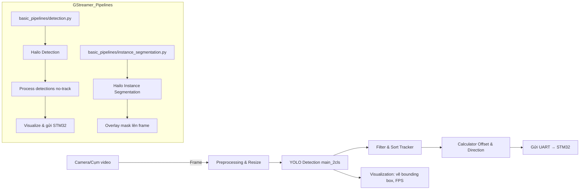
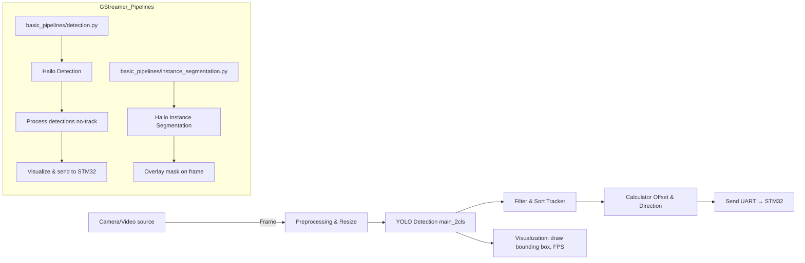

<marquee behavior="scroll" direction="left">🚀 **Hệ Thống Phát Hiện & Theo Dõi Vật Thể** 🚀</marquee>

> **LANGUAGE SWITCH**: Click on the language you prefer:
> <a href="#-hệ-thống-phát-hiện--theo-dõi-vật-thể">🇻🇳 Tiếng Việt</a> | 
> <a href="#-english-version-">🇬🇧 English</a>


# 📖 Hệ Thống Phát Hiện & Theo Dõi Vật Thể

> **Mô tả**: Đây là một bộ pipeline bao gồm nhiều module, sử dụng YOLO, GStreamer với Hailo, Sort tracker và giao tiếp đến STM32 để phát hiện, theo dõi và điều khiển hướng di chuyển dựa trên camera và cảm biến.

---

## 📋 Mục lục

- [Giới thiệu](#-giới-thiệu)  
- [Yêu cầu hệ thống](#-yêu-cầu-hệ-thống)  
- [Cài đặt & Khởi chạy](#-cài-đặt--khởi-chạy)  
- [Kiến trúc tổng quan](#-kiến-trúc-tổng-quan)  
- [Flowchart hệ thống](#-flowchart-hệ-thống)  
- [Chi tiết từng module](#-chi-tiết-từng-module)  
  - [1. main_2cls.py](#1-main_2clspy)  
  - [2. basic_pipelines/detection.py](#2-basic_pipelinesdetectionpy)  
  - [3. basic_pipelines/instance_segmentation.py](#3-basic_pipelinesinstance_segmentationpy)  
- [Kiểm thử](#-kiểm-thử)  
- [Ghi chú & Lời nhắc](#-ghi-chú--lời-nhắc)  

---

## 🔍 Giới thiệu
Hệ thống gồm:
- **Phát hiện 2 lớp** (basket, backboard) với YOLO engine (TensorRT).  
- **Theo dõi** bằng Sort tracker.  
- **Pipeline GStreamer** sử dụng Hailo-RPI cho phát hiện và phân đoạn.  
- **Giao tiếp STM32**: gửi offset & direction qua UART.  

---

## 🖥 Yêu cầu hệ thống
- OS: Linux (Raspberry Pi OS) hoặc Windows.  
- Python ≥ 3.7  
- OpenCV, ultralytics, numpy, hailo-apps-infra, GStreamer.  
- STM32 (UART), module lidar (tùy chọn).  

---

## ⚙️ Cài đặt & Khởi chạy
```bash
# Cài dependencies
pip install -r requirements.txt
# Chạy YOLO pipeline chính
python main_2cls.py
# Chạy GStreamer detection
python basic_pipelines/detection.py --input video.mp4
# Chạy GStreamer instance segmentation
python basic_pipelines/instance_segmentation.py --input video.mp4
```

---

## 🏗 Kiến trúc tổng quan


---

## 🗂 Chi tiết từng module

<details>
<summary>1. main_2cls.py</summary>

- Sử dụng `ultralytics.YOLO` để load engine TensorRT 2 lớp.  
- Dò tìm bounding box, confidence, phân biệt basket/backboard.  
- Dùng `cover.sort.Sort` để track object.  
- Tính offset với `calculator_offset_stm32()`, xác định direction với `auto_drive()`.  
- Gửi dữ liệu xuống STM32 qua hàm `create_stm32_message_1()` trong `cover.utils`.  
- Hiển thị kết quả trực tiếp (rectangle, FPS).  
</details>

<details>
<summary>2. basic_pipelines/detection.py</summary>

- Dựa trên GStreamer + Hailo RPI.  
- Nhận buffer, parse ROI → Hailo detections.  
- Chuyển thành format `(x1,y1,x2,y2,conf,class_id)`.  
- Xử lý bằng `process_detections_no_track()`.  
- Visualize tương tự, tính offset & direction.  
- (Tùy chọn) Gửi UART xuống STM32.  
- Quản lý FPS, chuyển frame sang BGR để hiển thị.  
</details>

<details>
<summary>3. basic_pipelines/instance_segmentation.py</summary>

- GStreamer Instance Segmentation App.  
- Skip frame để giảm tải.  
- Dùng Hailo để detect `person` + unique ID.  
- Lấy mask, reshape, overlay màu theo track_id.  
- In thông tin ID, label, confidence lên console.  
</details>

---

## ✅ Kiểm thử

Tập script `tests/test_edge_cases.py` kiểm:
- Đường dẫn video không tồn tại.  
- Định dạng file không hỗ trợ.  
- Tham số dòng lệnh không hợp lệ.  

```bash
pytest tests/test_edge_cases.py
```

---

## 📝 Ghi chú & Lời nhắc

- Thông tin cấu hình STM32: `cover/utils.py` & `cover/send_uart.py`.  
- Điều chỉnh ngưỡng tin cậy (`conf > 0.5`).  
- Có thể bổ sung module lidar để lấy khoảng cách thực.  
- Để mở rộng thêm class detection, rebuild engine YOLO tương ứng.  

> **TIP**: Nếu muốn xem minh họa động, có thể thêm file GIF vào `docs/pipeline_animation.gif` và nhúng:
> ```markdown
> 
> ```

---

# 🌐 English Version 🌐

<marquee behavior="scroll" direction="left">🚀 **Object Detection & Tracking System** 🚀</marquee>

# 📖 Object Detection & Tracking System

> **Description**: This is a pipeline system comprising multiple modules, using YOLO, GStreamer with Hailo, Sort tracker, and STM32 communication to detect, track, and control movement direction based on camera and sensors.

---

## 📋 Table of Contents

- [Introduction](#-introduction)  
- [System Requirements](#-system-requirements)  
- [Installation & Running](#-installation--running)  
- [System Architecture](#-system-architecture)  
- [System Flowchart](#-system-flowchart)  
- [Module Details](#-module-details)  
  - [1. main_2cls.py](#1-main_2clspy-1)  
  - [2. basic_pipelines/detection.py](#2-basic_pipelinesdetectionpy-1)  
  - [3. basic_pipelines/instance_segmentation.py](#3-basic_pipelinesinstance_segmentationpy-1)  
- [Testing](#-testing)  
- [Notes & Reminders](#-notes--reminders)  

---

## 🔍 Introduction
The system includes:
- **Two-class detection** (basket, backboard) with YOLO engine (TensorRT).  
- **Tracking** using Sort tracker.  
- **GStreamer pipeline** using Hailo-RPI for detection and segmentation.  
- **STM32 communication**: sending offset & direction via UART.  

---

## 🖥 System Requirements
- OS: Linux (Raspberry Pi OS) or Windows.  
- Python ≥ 3.7  
- OpenCV, ultralytics, numpy, hailo-apps-infra, GStreamer.  
- STM32 (UART), lidar module (optional).  

---

## ⚙️ Installation & Running
```bash
# Install dependencies
pip install -r requirements.txt
# Run main YOLO pipeline
python main_2cls.py
# Run GStreamer detection
python basic_pipelines/detection.py --input video.mp4
# Run GStreamer instance segmentation
python basic_pipelines/instance_segmentation.py --input video.mp4
```

---

## 🏗 System Architecture


---

## 🗂 Module Details

<details>
<summary>1. main_2cls.py</summary>

- Uses `ultralytics.YOLO` to load TensorRT 2-class engine.  
- Detects bounding boxes, confidence, distinguishes basket/backboard.  
- Uses `cover.sort.Sort` for object tracking.  
- Calculates offset with `calculator_offset_stm32()`, determines direction with `auto_drive()`.  
- Sends data to STM32 via `create_stm32_message_1()` function in `cover.utils`.  
- Displays results directly (rectangle, FPS).  
</details>

<details>
<summary>2. basic_pipelines/detection.py</summary>

- Based on GStreamer + Hailo RPI.  
- Receives buffer, parses ROI → Hailo detections.  
- Converts to format `(x1,y1,x2,y2,conf,class_id)`.  
- Processes using `process_detections_no_track()`.  
- Similar visualization, calculates offset & direction.  
- (Optional) Sends UART to STM32.  
- Manages FPS, converts frame to BGR for display.  
</details>

<details>
<summary>3. basic_pipelines/instance_segmentation.py</summary>

- GStreamer Instance Segmentation App.  
- Skips frames to reduce computational load.  
- Uses Hailo to detect `person` + unique ID.  
- Gets mask, reshapes, overlays color according to track_id.  
- Prints ID, label, confidence information to console.  
</details>

---

## ✅ Testing

The `tests/test_edge_cases.py` script tests:
- Non-existent video paths.  
- Unsupported file formats.  
- Invalid command-line parameters.  

```bash
pytest tests/test_edge_cases.py
```

---

## 📝 Notes & Reminders

- STM32 configuration info: `cover/utils.py` & `cover/send_uart.py`.  
- Adjust confidence threshold (`conf > 0.5`).  
- Can add lidar module to get actual distance.  
- To extend with more detection classes, rebuild corresponding YOLO engine.  

> **TIP**: If you want to see dynamic illustrations, you can add a GIF file to `docs/pipeline_animation.gif` and embed it:
> ```markdown
> 
> ```

